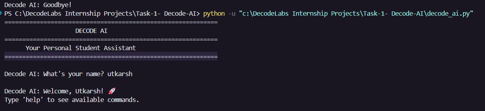
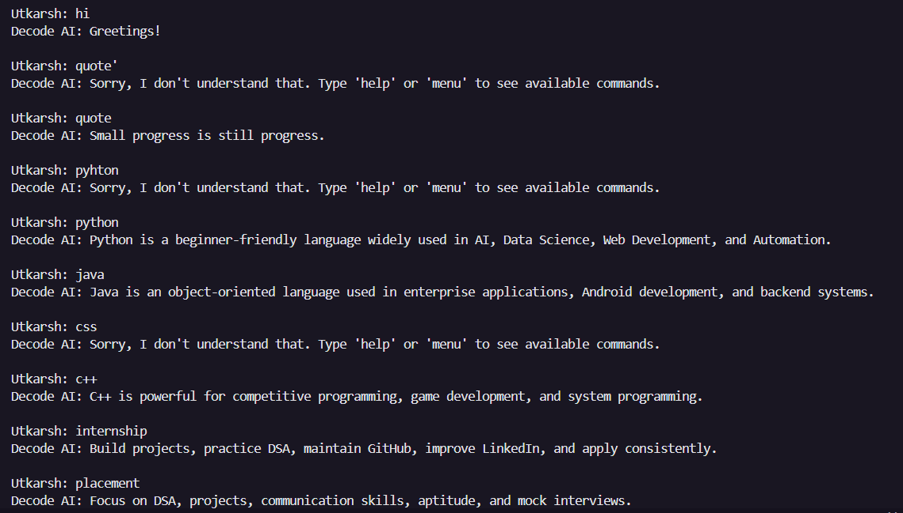
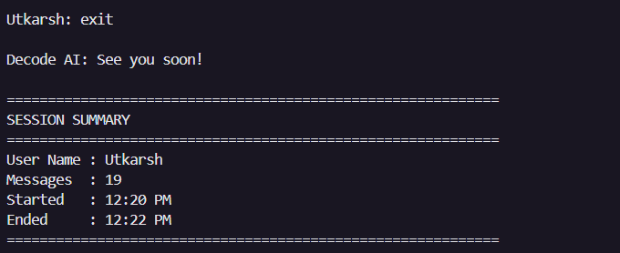

# 🚀 DecodeLabs Industrial Training Projects

This repository contains all projects completed as part of the DecodeLabs Industrial Training Program.

---

# 🤖 Task-1: Decode AI

Decode AI is a Rule-Based AI Chatbot built using Python.

The chatbot simulates basic human interaction using rule-based logic, dictionaries, control flow, and keyword matching without relying on any external AI APIs or machine learning models.

---

## 🚀 Features

### Core Features

* Continuous Chat Loop
* Greetings Handling
* Exit Commands
* Input Sanitization
* Rule-Based Responses
* Dictionary-Based Knowledge Base
* Default Fallback Response

### Advanced Features

* Personalized Greeting
* User Name Memory
* Current Date and Time
* Motivational Quotes
* Programming Guidance
* College & Career Guidance
* Help Menu
* About Section
* Clean Terminal User Interface

### Extra Features

* Keyword Matching
* Randomized Greetings
* Conversation Counter
* Session Summary on Exit

---

## 🛠 Technologies Used

* Python 3
* Dictionaries
* Functions
* Loops
* Conditional Statements
* Datetime Module
* Random Module

---

## 📂 Repository Structure

```text
decodelabs_tasks/
│
└── Task-1/
    ├── decode_ai.py
    ├── requirements.txt
    ├── README.md
    └── screenshots/
        ├── startup.png
        ├── chat.png
        └── session_summary.png
```

---

## ▶️ How to Run

### Clone Repository

```bash
git clone https://github.com/Utkarsh-cod/decodelabs_tasks.git
```

### Navigate to Task-1

```bash
cd Task-1
```

### Run Program

```bash
python decode_ai.py
```

---

## 💬 Sample Commands

### Greetings

```text
hello
hi
hey
good morning
```

### Date & Time

```text
date
today
time
current time
```

### Motivation

```text
quote
motivate me
```

### Programming Guidance

```text
python
java
c++
javascript
dsa
web development
ai
```

### College Guidance

```text
internship
resume
placement
cgpa
hackathon
project
```

### Other Commands

```text
what is my name
about
help
menu
exit
```

---

## 📸 Screenshots

### Startup Screen



### Chat Interaction



### Session Summary



---

## 🎯 Learning Outcomes

Through this project, I learned:

* Rule-Based AI Systems
* Control Flow Design
* Input Processing
* Dictionary-Based Lookup
* Keyword Matching
* User Interaction Design
* Python Programming Fundamentals

---

## 📌 Project Objective

The objective of this project is to understand the foundations of Artificial Intelligence through deterministic rule-based systems before moving toward advanced Machine Learning and Generative AI concepts.

---

## 👨‍💻 Author

**Utkarsh Agarwal**

B.Tech CSE (AI & ML)

ABES Engineering College

DecodeLabs Industrial Training Program 2026
