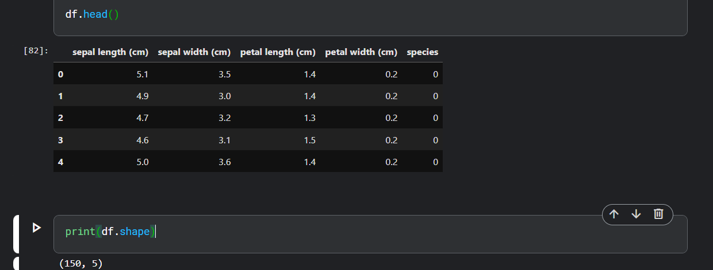
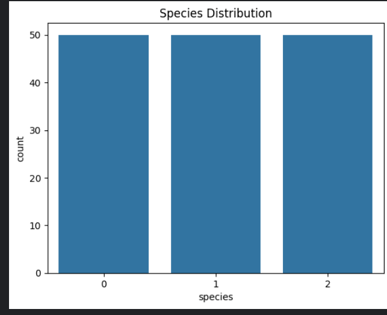
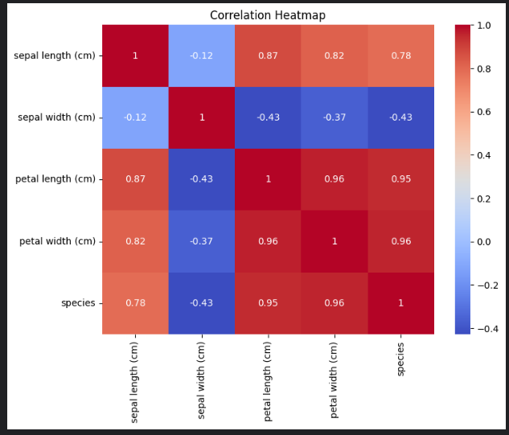
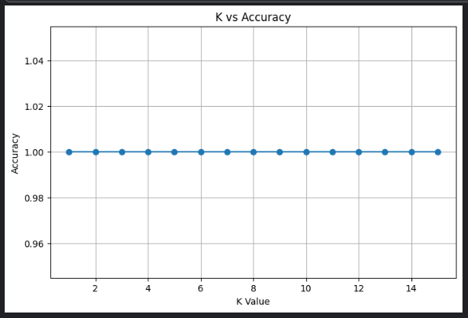
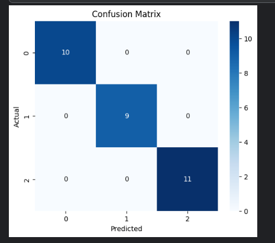
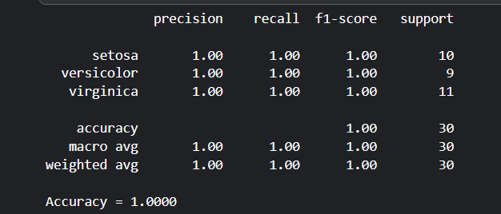
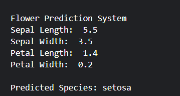

# 🌸 Iris AI Classifier

Iris AI Classifier is a Machine Learning project developed as part of the DecodeLabs Industrial Training Program.

The project uses the famous Iris Flower Dataset and the K-Nearest Neighbors (KNN) algorithm to classify iris flowers into three species:

* Setosa
* Versicolor
* Virginica

The project demonstrates the complete Machine Learning workflow including data exploration, visualization, preprocessing, model training, evaluation, optimization, and prediction.

---

## 🚀 Features

### Dataset Analysis

* Load Iris Dataset
* Dataset Exploration
* Data Statistics
* Class Distribution Analysis

### Data Visualization

* Species Distribution Graph
* Correlation Heatmap
* Feature Relationship Analysis

### Data Preprocessing

* Feature Selection
* Train-Test Split
* Standard Feature Scaling

### Machine Learning Model

* K-Nearest Neighbors (KNN) Classifier
* Multiple K Value Testing
* Best K Selection

### Model Evaluation

* Accuracy Score
* Confusion Matrix
* Classification Report
* Precision
* Recall
* F1-Score

### Interactive Prediction System

Users can enter:

* Sepal Length
* Sepal Width
* Petal Length
* Petal Width

and the model predicts the flower species.

---

## 🛠 Technologies Used

* Python
* NumPy
* Pandas
* Matplotlib
* Seaborn
* Scikit-Learn
* Jupyter Notebook

---

## 📂 Project Structure

```text
Task-2/
│
├── iris_ai_classifier.ipynb
├── README.md
├── requirements.txt
│
└── screenshots/
    ├── dataset_overview.png
    ├── species_distribution.png
    ├── correlation_heatmap.png
    ├── k_accuracy_graph.png
    ├── confusion_matrix.png
    ├── classification_report.png
    └── prediction_output.png
```

---

## 📊 Machine Learning Workflow

### Step 1: Dataset Loading

The Iris dataset is loaded using Scikit-Learn and converted into a Pandas DataFrame for analysis.

### Step 2: Data Exploration

The dataset is analyzed using:

* Head()
* Shape
* Info()
* Describe()

### Step 3: Data Visualization

Visualizations are created to understand:

* Species Distribution
* Feature Correlation

### Step 4: Data Preprocessing

Features are standardized using StandardScaler to improve model performance.

### Step 5: Model Training

The KNN algorithm is trained using the processed dataset.

### Step 6: Hyperparameter Tuning

Different K values are tested to determine the best-performing model.

### Step 7: Model Evaluation

Performance is measured using:

* Accuracy Score
* Confusion Matrix
* Classification Report

### Step 8: Prediction

The trained model predicts flower species based on user-provided measurements.

---

## 📈 Results

### Model Accuracy

```text
Accuracy = 1.0000
```

### Classification Performance

```text
Precision = 1.00
Recall = 1.00
F1-Score = 1.00
```

The model achieved perfect classification performance on the test dataset.

---

## 📸 Screenshots

### Dataset Overview



### Species Distribution



### Correlation Heatmap



### K vs Accuracy Graph



### Confusion Matrix



### Classification Report



### Prediction Output



---

## ▶️ How to Run

### Install Dependencies

```bash
pip install -r requirements.txt
```

### Launch Jupyter Notebook

```bash
jupyter notebook
```

### Open Notebook

```text
iris_ai_classifier.ipynb
```

Run all cells sequentially.

---

## 🎯 Learning Outcomes

Through this project, I learned:

* Data Analysis using Pandas
* Data Visualization using Matplotlib and Seaborn
* Feature Scaling
* K-Nearest Neighbors Classification
* Hyperparameter Tuning
* Model Evaluation Techniques
* Machine Learning Workflow
* Building Interactive Prediction Systems

---

## 📌 Project Objective

The objective of this project is to understand the fundamentals of Machine Learning classification using the K-Nearest Neighbors algorithm and gain practical experience with data preprocessing, model training, evaluation, and prediction.

---

## 👨‍💻 Author

**Utkarsh Agarwal**

B.Tech CSE (AI & ML)

ABES Engineering College

DecodeLabs Industrial Training Program 2026
