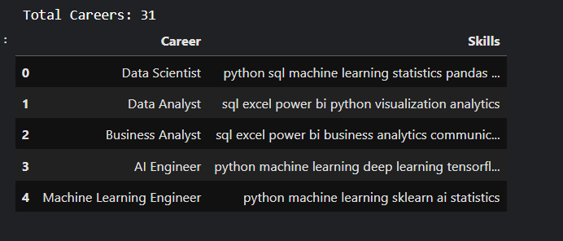
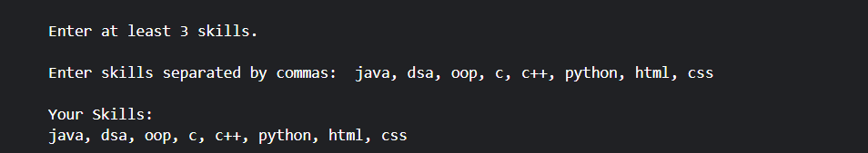
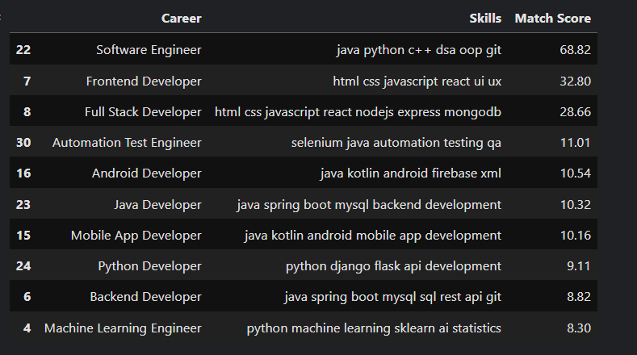
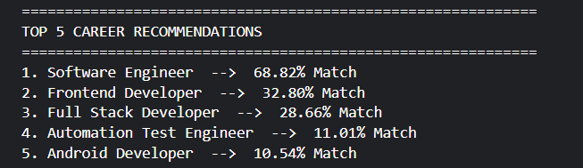
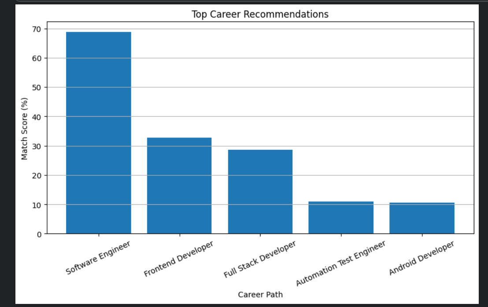
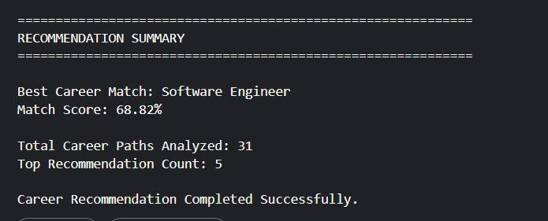

# 🎯 CareerPath AI Recommender

CareerPath AI Recommender is an AI-powered recommendation system developed as part of the DecodeLabs Industrial Training Program.

The project helps users discover suitable technology career paths based on their existing skills using TF-IDF Vectorization and Cosine Similarity. It analyzes user skills, compares them with predefined career profiles, and recommends the most relevant career options along with match scores and skill gap analysis.

---

## 🚀 Features

### Career Recommendation System

- User Skill Input
- Career Profile Matching
- Top-N Career Recommendations
- Match Score Calculation
- Ranked Career Suggestions

### AI Techniques Used

- TF-IDF Vectorization
- Cosine Similarity
- Content-Based Recommendation System

### Analysis Features

- Recommendation Table
- Top 5 Career Suggestions
- Match Percentage Scores
- Skill Gap Analysis
- User Strength Analysis

### Visualization

- Career Recommendation Graph
- Match Score Comparison Chart

---

## 🛠 Technologies Used

- Python
- Pandas
- NumPy
- Matplotlib
- Scikit-Learn
- Jupyter Notebook

---

## 📂 Project Structure

```text
Task-3/
│
├── careerpath_ai_recommender.ipynb
├── README.md
├── requirements.txt
│
└── screenshots/
    ├── dataset_preview.png
    ├── user_input.png
    ├── recommendation_table.png
    ├── top_recommendations.png
    ├── match_score_graph.png
    ├── skill_gap_analysis.png
    └── recommendation_summary.png
```

---

## ⚙️ Working Process

### Step 1: Career Dataset Creation

A dataset containing multiple technology career paths and their required skills is created.

### Step 2: User Skill Input

The user enters their existing skills.

Example:

```text
java, dsa, oop, c, c++, python, html, css
```

### Step 3: TF-IDF Vectorization

The skills are converted into numerical vectors using TF-IDF Vectorization.

### Step 4: Similarity Calculation

Cosine Similarity is used to measure how closely the user's skills match each career profile.

### Step 5: Recommendation Generation

The system ranks all careers based on similarity scores and displays the top recommendations.

### Step 6: Skill Gap Analysis

Missing skills required for the best-matched career are identified and suggested to the user.

---

## 📊 Sample Output

### User Skills

```text
java, dsa, oop, c, c++, python, html, css
```

### Best Career Match

```text
Software Engineer
```

### Match Score

```text
68.82%
```

### Suggested Skills

```text
git
```

---

## 📸 Screenshots

### Dataset Preview



### User Input



### Recommendation Table



### Top Career Recommendations



### Match Score Graph



### Skill Gap Analysis


### Recommendation Summary



---

## ▶️ How to Run

### Install Dependencies

```bash
pip install -r requirements.txt
```

### Launch Jupyter Notebook

```bash
jupyter notebook
```

### Open Notebook

```text
careerpath_ai_recommender.ipynb
```

Run all cells sequentially.

---

## 🎯 Learning Outcomes

Through this project, I learned:

- Recommendation Systems
- Content-Based Filtering
- TF-IDF Vectorization
- Cosine Similarity
- Data Processing
- Career Recommendation Logic
- Data Visualization
- AI-Based Decision Making

---

## 📌 Project Objective

The objective of this project is to understand the fundamentals of recommendation systems by building a content-based career recommendation engine that suggests suitable technology career paths based on user skills.

---

## 👨‍💻 Author

**Utkarsh Agarwal**

B.Tech CSE (AI & ML)

ABES Engineering College

DecodeLabs Industrial Training Program 2026